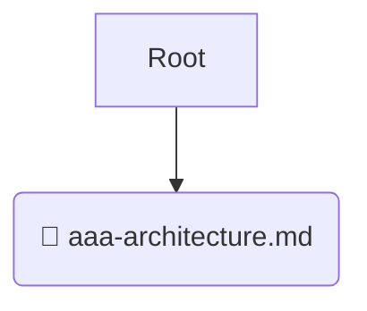

# 📂 workflows

*Breadcrumbs:* [.agent](/.agent) / [workflows](/.agent/workflows)

## 🎯 PURPOSE
This directory `workflows` is an integral part of the Mavluda Beauty ecosystem.
This directory is meticulously maintained to uphold the 'Luxury Professional' standards of the Mavluda Beauty brand.

## 🏗️ ARCHITECTURE


## 📄 FILE REGISTRY
| File Name | Type | Responsibility | Key Aliases Used |
|---|---|---|---|
| `aaa-architecture.md` | `md` | Core functionality | `None` |

## 🔗 DEPENDENCIES
- No significant internal/external dependencies found.

## 🛠️ USAGE
```typescript
// Example placeholder for interacting with the workflows module
import { example } from './aaa-architecture.md';
```
