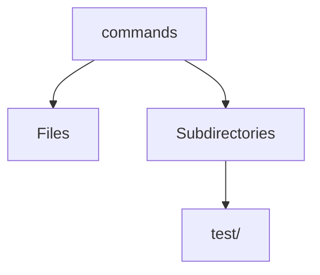

# 🏷️ Commands Directory

> *Elegance, Precision, and Luxury Professionalism — The Mavluda Beauty Standard.*

## 🧭 Breadcrumb Navigation
[.gemini](/.gemini) ➔ [commands](/.gemini/commands)

## 🎯 Purpose
This directory encapsulates the essential architecture and logic for the **Commands** domain within the Mavluda Beauty ecosystem. It serves as a foundational component ensuring robust, scalable, and elegant operations.

## 🏗️ Architecture


## 📄 File Registry
| File Name | Type | Responsibility | Key Aliases Used |
|---|---|---|---|
| *No files* | - | - | - |

## 🔗 Dependencies
No external or cross-module dependencies detected.

## 🛠️ Usage
```typescript
// This directory primarily serves organizational or static purposes.
// Reference its contents dynamically based on your feature requirements.
```
