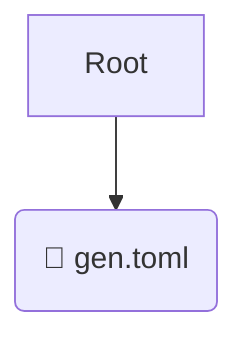

# 🧪 test

*Breadcrumbs:* [.gemini](/.gemini) / [commands](/.gemini/commands) / [test](/.gemini/commands/test)

## 🎯 PURPOSE
This directory `test` is an integral part of the Mavluda Beauty ecosystem.
This directory is meticulously maintained to uphold the 'Luxury Professional' standards of the Mavluda Beauty brand.

## 🏗️ ARCHITECTURE


## 📄 FILE REGISTRY
| File Name | Type | Responsibility | Key Aliases Used |
|---|---|---|---|
| `gen.toml` | `toml` | Core functionality | `None` |

## 🔗 DEPENDENCIES
- No significant internal/external dependencies found.

## 🛠️ USAGE
```typescript
// Example placeholder for interacting with the test module
import { example } from './gen.toml';
```
