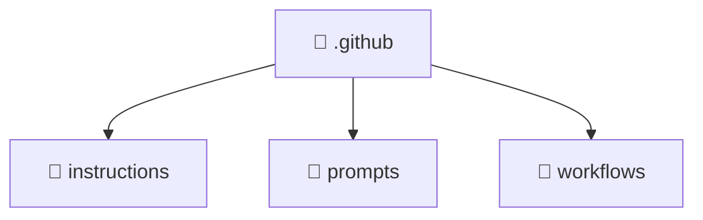

<!--
Mavluda Beauty - Luxury Professional Documentation
Generated for 100% Architectural Transparency
-->
[Home](../README.md) > [.github](./README.md)

# 📁 .GITHUB Directory

## 🎯 PURPOSE
Provides foundational structure and logic for the .github component within the Mavluda Beauty ecosystem.

## 🏗️ ARCHITECTURE


## 📄 FILE REGISTRY
| File Name | Type | Responsibility | Key Aliases Used |
|---|---|---|---|
| (No files) | - | - | - |


## 🔗 DEPENDENCIES
- No external or internal imports detected in this directory.

## 🛠️ USAGE
```typescript
// Example placeholder for interacting with .github
// Consult the individual files in the registry for specific APIs.
```
