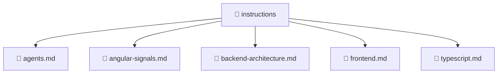

[Root](/.) > [.github](/.github) > [instructions](/.github/instructions)

# 📁 Instructions

## 🎯 Purpose
Delivering luxury-tier architectural components and high-performance logic for the **instructions** domain. This directory is a crucial part of the Mavluda Beauty full-stack ecosystem, ensuring seamless scalability, robust performance, and an elite digital experience.

## 🏗️ Architecture


## 📄 File Registry
| File Name | Type | Responsibility | Key Aliases Used |
|---|---|---|---|
| `agents.md` | Markdown | Core logic and utilities for this domain. | @entities |
| `angular-signals.md` | Markdown | Core logic and utilities for this domain. | N/A |
| `backend-architecture.md` | Markdown | Core logic and utilities for this domain. | N/A |
| `frontend.md` | Markdown | Core logic and utilities for this domain. | @angular |
| `typescript.md` | Markdown | Core logic and utilities for this domain. | @entities |

## 🔗 Dependencies
- `./api/update-veil.service`, `./application/admin-settings.service`, `./application/dto/settings-response.dto`, `./application/dto/update-settings.dto`, `./domain/entities/admin-settings.entity`, `./model/veil.data`, `./ui/veil.component`, `@angular/core`, `@entities/veil`, `@entities/veil/api/veil.service`

## 🛠️ Usage
```typescript
// Example usage within the Mavluda Beauty ecosystem
import { relevantMember } from './core';

// Integrate into the application architecture
relevantMember.execute();
```