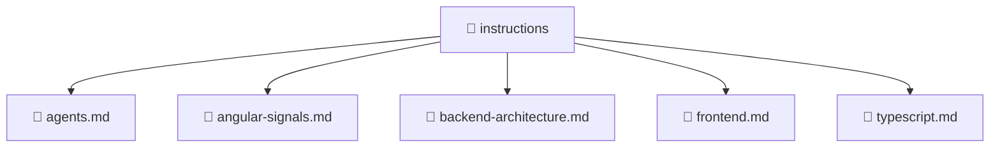

<!--
Mavluda Beauty - Luxury Professional Documentation
Generated for 100% Architectural Transparency
-->
[Home](../../README.md) > [.github](../README.md) > [instructions](./README.md)

# 📁 INSTRUCTIONS Directory

## 🎯 PURPOSE
Provides foundational structure and logic for the instructions component within the Mavluda Beauty ecosystem.

## 🏗️ ARCHITECTURE


## 📄 FILE REGISTRY
| File Name | Type | Responsibility | Key Aliases Used |
|---|---|---|---|
| `agents.md` | Code | Core logic implementation. | @entities |
| `angular-signals.md` | Code | Core logic implementation. | - |
| `backend-architecture.md` | Code | Core logic implementation. | - |
| `frontend.md` | Code | Core logic implementation. | @angular |
| `typescript.md` | Code | Core logic implementation. | @entities |


## 🔗 DEPENDENCIES
- `@entities/veil/api/veil.service`
- `@entities/veil`
- `@angular/core`

## 🛠️ USAGE
```typescript
// Example placeholder for interacting with instructions
// Consult the individual files in the registry for specific APIs.
```
