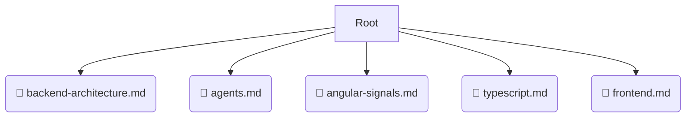

# 📂 instructions

*Breadcrumbs:* [.github](/.github) / [instructions](/.github/instructions)

## 🎯 PURPOSE
This directory `instructions` is an integral part of the Mavluda Beauty ecosystem.
This directory is meticulously maintained to uphold the 'Luxury Professional' standards of the Mavluda Beauty brand.

## 🏗️ ARCHITECTURE


## 📄 FILE REGISTRY
| File Name | Type | Responsibility | Key Aliases Used |
|---|---|---|---|
| `backend-architecture.md` | `md` | Core functionality | `None` |
| `agents.md` | `md` | Core functionality | `@entities/veil/api/veil.service, @entities/veil` |
| `angular-signals.md` | `md` | Core functionality | `None` |
| `typescript.md` | `md` | Core functionality | `@entities/veil/api/veil.service, @entities/veil` |
| `frontend.md` | `md` | Core functionality | `@angular/core` |

## 🔗 DEPENDENCIES
- `@entities/veil/api/veil.service`
- `@angular/core`
- `@entities/veil`

## 🛠️ USAGE
```typescript
// Example placeholder for interacting with the instructions module
import { example } from './backend-architecture.md';
```
