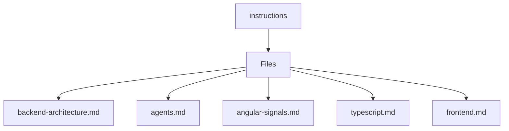

# 🏷️ Instructions Directory

> *Elegance, Precision, and Luxury Professionalism — The Mavluda Beauty Standard.*

## 🧭 Breadcrumb Navigation
[.github](/.github) ➔ [instructions](/.github/instructions)

## 🎯 Purpose
This directory encapsulates the essential architecture and logic for the **Instructions** domain within the Mavluda Beauty ecosystem. It serves as a foundational component ensuring robust, scalable, and elegant operations.

## 🏗️ Architecture


## 📄 File Registry
| File Name | Type | Responsibility | Key Aliases Used |
|---|---|---|---|
| `backend-architecture.md` | File | Defines logic and structure for backend-architecture.md. | None |
| `agents.md` | File | Defines logic and structure for agents.md. | @modules, @features, @app, @entities, @shared |
| `angular-signals.md` | File | Defines logic and structure for angular-signals.md. | None |
| `typescript.md` | File | Defines logic and structure for typescript.md. | @features, @entities, @shared |
| `frontend.md` | File | Exports: ExampleComponent, DataService, BadComponent... | None |

## 🔗 Dependencies
- `@angular/core`
- `@entities/veil`
- `@entities/veil/api/veil.service`

## 🛠️ Usage
```typescript
// To utilize the luxurious capabilities of this module:
import { ExampleComponent } from './path/to/examplecomponent';

// Ensure properly typed interactions per Mavluda Beauty standards
```
