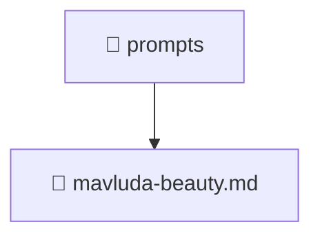

<!--
Mavluda Beauty - Luxury Professional Documentation
Generated for 100% Architectural Transparency
-->
[Home](../../README.md) > [.github](../README.md) > [prompts](./README.md)

# 📁 PROMPTS Directory

## 🎯 PURPOSE
Provides foundational structure and logic for the prompts component within the Mavluda Beauty ecosystem.

## 🏗️ ARCHITECTURE


## 📄 FILE REGISTRY
| File Name | Type | Responsibility | Key Aliases Used |
|---|---|---|---|
| `mavluda-beauty.md` | Code | Core logic implementation. | - |


## 🔗 DEPENDENCIES
- No external or internal imports detected in this directory.

## 🛠️ USAGE
```typescript
// Example placeholder for interacting with prompts
// Consult the individual files in the registry for specific APIs.
```
