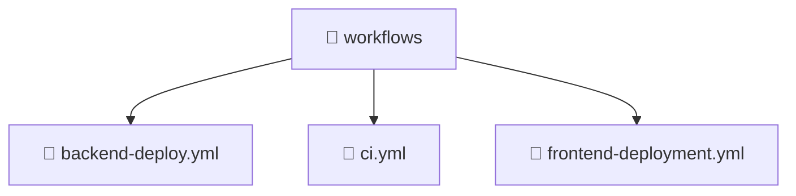

# 📁 Mavluda Beauty workflows

[.github](/.github) / [workflows](/.github/workflows)

## 🎯 Purpose
Delivering luxury-tier architectural components and high-performance logic for the **workflows** domain. This directory is a crucial part of the Mavluda Beauty full-stack ecosystem, ensuring seamless scalability, robust performance, and an elite digital experience.

## 🏗️ Architecture


## 📄 File Registry
| File Name | Type | Responsibility | Key Aliases Used |
|---|---|---|---|
| `backend-deploy.yml` | File | Core logic and utilities for this domain. | N/A |
| `ci.yml` | File | Core logic and utilities for this domain. | N/A |
| `frontend-deployment.yml` | File | Core logic and utilities for this domain. | N/A |


## 🔗 Dependencies
No external or alias dependencies detected.

## 🛠️ Usage
```typescript
// Example integration for workflows
// Import capabilities from this directory to enrich your modules.
```
> This directory provides specialized logic tailored to the Mavluda Beauty standard.
