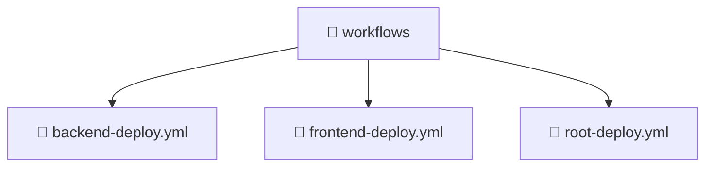

[Root](/.) > [.github](/.github) > [workflows](/.github/workflows)

# 📁 Workflows

## 🎯 Purpose
Delivering luxury-tier architectural components and high-performance logic for the **workflows** domain. This directory is a crucial part of the Mavluda Beauty full-stack ecosystem, ensuring seamless scalability, robust performance, and an elite digital experience.

## 🏗️ Architecture


## 📄 File Registry
| File Name | Type | Responsibility | Key Aliases Used |
|---|---|---|---|
| `backend-deploy.yml` | File | Core logic and utilities for this domain. | N/A |
| `frontend-deploy.yml` | File | Provides core logic and orchestration for frontend-deploy.yml. | N/A |
| `root-deploy.yml` | File | Provides core logic and orchestration for root-deploy.yml. | N/A |

## 🔗 Dependencies
- No external dependencies.

## 🛠️ Usage
```typescript
// Example usage within the Mavluda Beauty ecosystem
import { relevantMember } from './core';

// Integrate into the application architecture
relevantMember.execute();
```