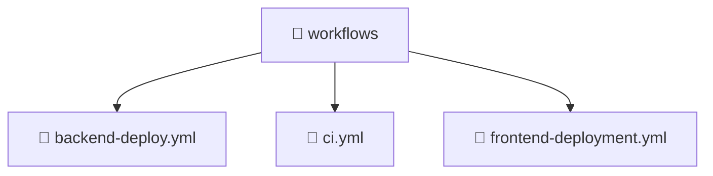

<!--
Mavluda Beauty - Luxury Professional Documentation
Generated for 100% Architectural Transparency
-->
[Home](../../README.md) > [.github](../README.md) > [workflows](./README.md)

# 📁 WORKFLOWS Directory

## 🎯 PURPOSE
Provides foundational structure and logic for the workflows component within the Mavluda Beauty ecosystem.

## 🏗️ ARCHITECTURE


## 📄 FILE REGISTRY
| File Name | Type | Responsibility | Key Aliases Used |
|---|---|---|---|
| `backend-deploy.yml` | Code | Core logic implementation. | - |
| `ci.yml` | Code | Core logic implementation. | - |
| `frontend-deployment.yml` | Code | Core logic implementation. | - |


## 🔗 DEPENDENCIES
- No external or internal imports detected in this directory.

## 🛠️ USAGE
```typescript
// Example placeholder for interacting with workflows
// Consult the individual files in the registry for specific APIs.
```
