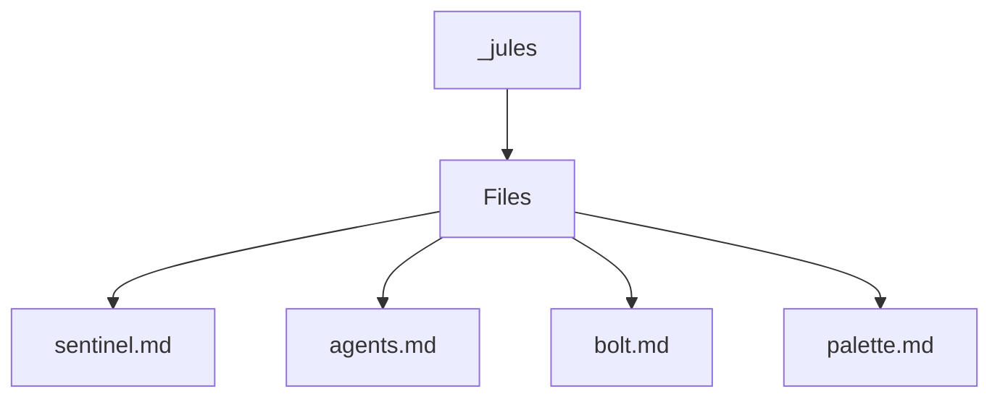

# 🏷️ .Jules Directory

> *Elegance, Precision, and Luxury Professionalism — The Mavluda Beauty Standard.*

## 🧭 Breadcrumb Navigation
[.jules](/.jules)

## 🎯 Purpose
This directory encapsulates the essential architecture and logic for the **.Jules** domain within the Mavluda Beauty ecosystem. It serves as a foundational component ensuring robust, scalable, and elegant operations.

## 🏗️ Architecture


## 📄 File Registry
| File Name | Type | Responsibility | Key Aliases Used |
|---|---|---|---|
| `sentinel.md` | File | Defines logic and structure for sentinel.md. | None |
| `agents.md` | File | Defines logic and structure for agents.md. | @modules, @features, @app, @entities, @shared |
| `bolt.md` | File | Defines logic and structure for bolt.md. | None |
| `palette.md` | File | Defines logic and structure for palette.md. | None |

## 🔗 Dependencies
- `@entities/veil`
- `@entities/veil/api/veil.service`

## 🛠️ Usage
```typescript
// This directory primarily serves organizational or static purposes.
// Reference its contents dynamically based on your feature requirements.
```
