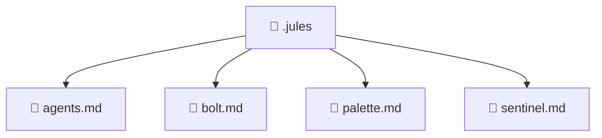

### 🧭 Breadcrumbs
[Root](/) > [.jules](/.jules)

# 📁 .jules Directory
**Architecture Layer:** Domain/Infrastructure Layer

## 🎯 Purpose
Provides luxury professional architectural implementation for the .jules module within the Mavluda Beauty ecosystem. Ensure robust functionality and elegant integration with the broader architecture.

## 🏗️ ARCHITECTURE

## 📄 FILE REGISTRY
| File Name | Type | Responsibility | Key Aliases Used |
|---|---|---|---|
| `agents.md` | Markdown | Core logic and utilities for this domain. | N/A |
| `bolt.md` | Markdown | Core logic and utilities for this domain. | N/A |
| `palette.md` | Markdown | Core logic and utilities for this domain. | N/A |
| `sentinel.md` | Markdown | Core logic and utilities for this domain. | N/A |

## 🔗 DEPENDENCIES
*No internal path alias dependencies explicitly resolved in this directory.*

## 🛠️ USAGE
Review the files in this directory for `.jules` integration and styling standards.

---
*Maintained by Mavluda Beauty - Architecture & Engineering*

---
*Maintained by Mavluda Beauty - Architecture & Engineering*