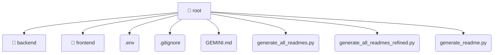

# [root](/)

## 🏷️ 📁 Root

### 🎯 PURPOSE
The `root` directory forms a critical foundation within the Mavluda Beauty ecosystem, meticulously orchestrating the root logic to ensure a seamless and premium experience.

### 🏗️ ARCHITECTURE


### 📄 FILE REGISTRY
| File Name | Type | Responsibility | Key Aliases Used |
|---|---|---|---|
| `.env` | `env` | Configuration and foundational asset. | None |
| `.gitignore` | `gitignore` | Configuration and foundational asset. | None |
| `GEMINI.md` | `md` | Configuration and foundational asset. | None |
| `generate_all_readmes.py` | `py` | Configuration and foundational asset. | None |
| `generate_all_readmes_refined.py` | `py` | Configuration and foundational asset. | None |
| `generate_readme.py` | `py` | Configuration and foundational asset. | None |


### 🔗 DEPENDENCIES
- *Self-contained premium module.*

### 🛠️ USAGE
```typescript
// Seamlessly integrate root into your refined workflows:
import { /* exported members */ } from '@path/to/root';
```
