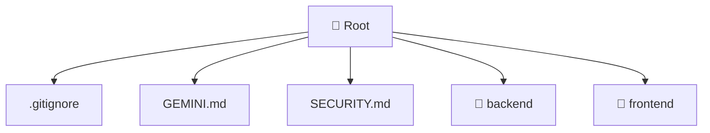

[🏠 Home](./README.md)

# 📁 Mavluda Beauty Repository Root

### 🎯 PURPOSE
Welcome to the exquisite **Mavluda Beauty Repository Root** module of the Mavluda Beauty ecosystem. This directory handles specific domain assets and logic. It is designed adhering to our 'Luxury Professional' standards.

### 🏗️ ARCHITECTURE


### 📄 FILE REGISTRY
| File Name | Type | Responsibility | Key Aliases Used |
|---|---|---|---|
| `.gitignore` | Asset / File | Provides logic and definitions for .gitignore. | None |
| `GEMINI.md` | Markdown Document | Provides logic and definitions for GEMINI.md. | None |
| `SECURITY.md` | Markdown Document | Provides logic and definitions for SECURITY.md. | None |

### 🔗 DEPENDENCIES
No notable dependencies detected.

### 🛠️ USAGE
```typescript
// Example interaction or integration snippet
// Import members from Mavluda Beauty Repository Root based on module boundaries
```
