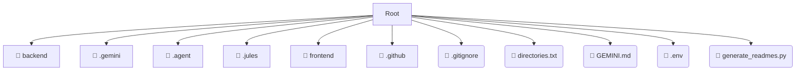

# 📂 .

*Breadcrumbs:* [.](/.)

## 🎯 PURPOSE
This directory `.` is an integral part of the Mavluda Beauty ecosystem.
This directory is meticulously maintained to uphold the 'Luxury Professional' standards of the Mavluda Beauty brand.

## 🏗️ ARCHITECTURE


## 📄 FILE REGISTRY
| File Name | Type | Responsibility | Key Aliases Used |
|---|---|---|---|
| `.gitignore` | `gitignore` | Core functionality | `None` |
| `directories.txt` | `txt` | Core functionality | `None` |
| `GEMINI.md` | `md` | Core functionality | `None` |
| `.env` | `env` | Core functionality | `None` |
| `generate_readmes.py` | `py` | Core functionality | `None` |

## 🔗 DEPENDENCIES
- No significant internal/external dependencies found.

## 🛠️ USAGE
```typescript
// Example placeholder for interacting with the . module
import { example } from './.gitignore';
```
