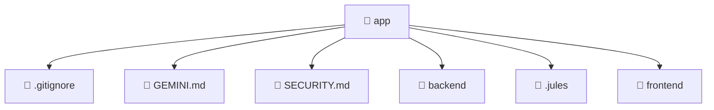

### 🧭 Breadcrumbs
[Root](/)

# 📁 App Directory
**Architecture Layer:** Root Layer

## 🎯 Purpose
Provides luxury professional architectural implementation for the app module within the Mavluda Beauty ecosystem. Ensure robust functionality and elegant integration with the broader architecture.

## 🏗️ ARCHITECTURE

## 📄 FILE REGISTRY
| File Name | Type | Responsibility | Key Aliases Used |
|---|---|---|---|
| `.gitignore` | File | Provides core logic and orchestration for .gitignore. | N/A |
| `GEMINI.md` | Markdown | Provides core logic and orchestration for GEMINI.md. | N/A |
| `SECURITY.md` | Markdown | Documentation. | N/A |

## 🔗 DEPENDENCIES
*No internal path alias dependencies explicitly resolved in this directory.*

## 🛠️ USAGE
Review the files in this directory for `app` integration and styling standards.

---
*Maintained by Mavluda Beauty - Architecture & Engineering*

---
*Maintained by Mavluda Beauty - Architecture & Engineering*