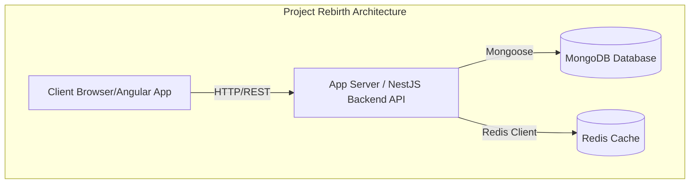

# Mavluda Beauty - Full Stack Application

## Overview
This is a full-stack application for Mavluda Beauty. The backend is built with NestJS and provides a robust, modular API. The frontend is built with Angular 19+ and features a modern, reactive UI using Signals and NgRx.

## Architecture

The system consists of three main components:
1.  **Frontend (Angular):** Handles user interactions, displaying the catalog, gallery, and admin dashboard.
2.  **Backend (NestJS):** Provides RESTful API endpoints, business logic, authentication, and database interactions.
3.  **Database (MongoDB):** Stores all persistent data, such as users, treatments, veils, and gallery items.
4.  **Cache (Redis):** Used for session management and caching where appropriate.



## Setup & Running

### Docker (Recommended)
You can run the entire stack using Docker Compose:

```bash
docker-compose up --build
```
This will start the Frontend (port 80), Backend (port 3000), MongoDB, and Redis.

### Local Development

**Backend:**
1. Navigate to the `backend` directory.
2. `npm install`
3. Copy `.env.example` to `.env` and fill in the required values (or use defaults).
4. `npm run start:dev`

**Frontend:**
1. Navigate to the `frontend` directory.
2. `npm install`
3. `npm run dev`

## API Documentation
The backend exposes a Swagger UI for API documentation. When the backend is running, you can access it at:
`http://localhost:3000/api/docs`

## Features

- **Authentication:** JWT and Google OAuth strategies using Passport.js.
- **Admin Panel:** Secured routes for managing content.
- **Catalog:** Display veils and treatments with optimized images (`NgOptimizedImage`).
- **State Management:** Uses NgRx and Signals.
- **Testing:** Vitest for frontend unit tests, Jest for backend, and Playwright for E2E testing.
