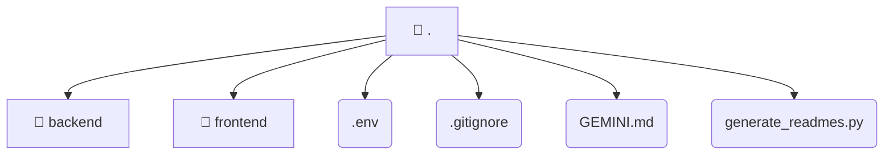

# [root](/)

## 🏷️ 📁 .

### 🎯 PURPOSE
The `.` directory is a foundational part of the Mavluda Beauty ecosystem.

### 🏗️ ARCHITECTURE


### 📄 FILE REGISTRY
| File Name | Type | Responsibility | Key Aliases Used |
|---|---|---|---|
| `.env` | `env` | Core logic or foundational asset for this directory. | None |
| `.gitignore` | `gitignore` | Core logic or foundational asset for this directory. | None |
| `GEMINI.md` | `md` | Core logic or foundational asset for this directory. | None |
| `generate_readmes.py` | `py` | Core logic or foundational asset for this directory. | @path |

### 🔗 DEPENDENCIES
- `@path/to/{dirname}`

### 🛠️ USAGE
```typescript
// Seamlessly integrate . into your refined workflows:
import { /* exported members */ } from '@path/to/.';
```
