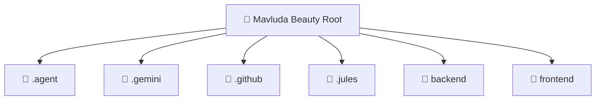

# 👑 Mavluda Beauty Root

[Root](/.)

## 🎯 Purpose
Delivering luxury-tier architectural components and high-performance logic for the **Mavluda Beauty Root** domain. This directory is a crucial part of the Mavluda Beauty full-stack ecosystem, ensuring seamless scalability, robust performance, and an elite digital experience.

## 🏗️ Architecture


## 📄 File Registry
| File Name | Type | Responsibility | Key Aliases Used |
|---|---|---|---|
| `.env` | Configuration | Project level settings and dependencies. | N/A |
| `.gitignore` | Configuration | Project level settings and dependencies. | N/A |
| `.gitignore_append` | File | Core logic and utilities for this domain. | N/A |
| `GEMINI.md` | File | Core logic and utilities for this domain. | N/A |
| `generate_readmes.js` | File | Core logic and utilities for this domain. | N/A |


## 🔗 Dependencies
- `./${tsFile.name.replace(/\.ts$/, `

## 🛠️ Usage
```markdown
> This directory acts primarily as a structural container or configuration hub.
```
