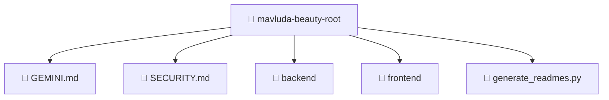

# 📁 mavluda-beauty-root

[Root](/.)

## 🎯 Purpose
Delivering luxury-tier architectural components and high-performance logic for the **Mavluda Beauty Repository** domain. This directory is a crucial part of the Mavluda Beauty full-stack ecosystem, ensuring seamless scalability, robust performance, and an elite digital experience.

## 🏗️ Architecture


## 📄 File Registry
| File Name | Type | Responsibility | Key Aliases Used |
|---|---|---|---|
| `GEMINI.md` | MD | Handles logic and definitions for GEMINI.md | None |
| `SECURITY.md` | MD | Handles logic and definitions for SECURITY.md | None |
| `generate_readmes.py` | PY | Handles logic and definitions for generate_readmes.py | None |

## 🔗 Dependencies
*(No specific external or cross-module dependencies detected)*

## 🛠️ Usage
```typescript
// Example usage within the Mavluda Beauty ecosystem
import { relevantMember } from './mavluda-beauty-root';

// Integrate into the application architecture
relevantMember.execute();
```
