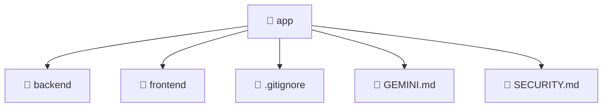

# 📁 app

[Root](/.)

## 🎯 Purpose
Delivering luxury-tier architectural components and high-performance logic for the **app** domain. This directory is a crucial part of the Mavluda Beauty full-stack ecosystem, ensuring seamless scalability, robust performance, and an elite digital experience.

## 🏗️ Architecture


## 📄 File Registry
| File Name | Type | Responsibility | Key Aliases Used |
|---|---|---|---|
| `.gitignore` | File | Provides core logic and orchestration for .gitignore. | N/A |
| `GEMINI.md` | Markdown | Provides core logic and orchestration for GEMINI.md. | N/A |
| `SECURITY.md` | Markdown | Provides core logic and orchestration for SECURITY.md. | N/A |

## 🔗 Dependencies
- No external dependencies.

## 🛠️ Usage
```typescript
// Example usage within the Mavluda Beauty ecosystem
import { relevantMember } from './app';

// Integrate into the application architecture
relevantMember.execute();
```
