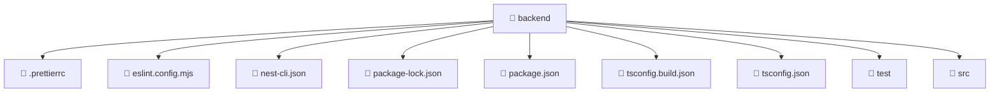

### 🧭 Breadcrumbs
[Root](/) > [backend](/backend)

# 📁 Backend Directory
**Architecture Layer:** Domain/Infrastructure Layer

## 🎯 Purpose
Provides luxury professional architectural implementation for the backend module within the Mavluda Beauty ecosystem. Ensure robust functionality and elegant integration with the broader architecture.

## 🏗️ ARCHITECTURE

## 📄 FILE REGISTRY
| File Name | Type | Responsibility | Key Aliases Used |
|---|---|---|---|
| `.prettierrc` | File | Provides core logic and orchestration for .prettierrc. | N/A |
| `eslint.config.mjs` | File | Provides core logic and orchestration for eslint.config.mjs. | N/A |
| `nest-cli.json` | JSON Configuration | Provides core logic and orchestration for nest-cli.json. | N/A |
| `package-lock.json` | JSON Configuration | Provides core logic and orchestration for package-lock.json. | N/A |
| `package.json` | JSON Configuration | Provides core logic and orchestration for package.json. | N/A |
| `tsconfig.build.json` | JSON Configuration | Provides core logic and orchestration for tsconfig.build.json. | N/A |
| `tsconfig.json` | JSON Configuration | Provides core logic and orchestration for tsconfig.json. | N/A |

## 🔗 DEPENDENCIES
*No internal path alias dependencies explicitly resolved in this directory.*

## 🛠️ USAGE
Review the files in this directory for `backend` integration and styling standards.

---
*Maintained by Mavluda Beauty - Architecture & Engineering*

---
*Maintained by Mavluda Beauty - Architecture & Engineering*