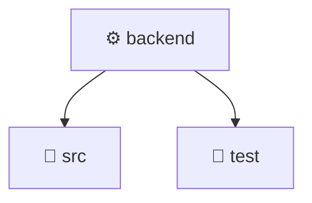

# ⚙️ backend

[Root](/.) / [backend](.)

## 🎯 Purpose
Delivering luxury-tier architectural components and high-performance logic for the **backend** domain. This directory orchestrates precise operations within the Mavluda Beauty ecosystem, maintaining our elite standards of digital excellence.

## 🏗️ Architecture


## 📄 File Registry
| File Name | Type | Responsibility | Key Aliases Used |
|---|---|---|---|
| `.prettierrc` | File | Core logic and utilities for this domain. | N/A |
| `eslint.config.mjs` | JavaScript | Core logic and utilities for this domain. | N/A |
| `nest-cli.json` | Configuration | Configuration and environment settings. | N/A |
| `package-lock.json` | Configuration | Configuration and environment settings. | N/A |
| `package.json` | Configuration | Configuration and environment settings. | N/A |
| `tsconfig.build.json` | Configuration | Configuration and environment settings. | N/A |
| `tsconfig.json` | Configuration | Configuration and environment settings. | N/A |

## 🔗 Dependencies
*No internal path aliases detected in this directory.*

## 🛠️ Usage
```markdown
> This directory acts primarily as a structural container or logic module.
> To interact with its contents, import the relevant exported members from the `index.ts` or specifically targeted files.
```
