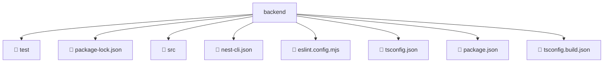

# 📂 BACKEND

> 💎 **Mavluda Beauty - Luxury Professional Architecture**

### 📍 Breadcrumb Navigation
`. > backend`

## 🎯 PURPOSE
This directory encapsulates `General` level functionality within the Mavluda Beauty ecosystem, ensuring proper separation of concerns and architectural transparency.

**FSD / Architecture Layer:** `General`

## 🏗️ ARCHITECTURE


## 📄 FILE REGISTRY

| Item Name | Type | Responsibility | Key Aliases Used |
|-----------|------|----------------|------------------|
| `📁 test` | `Directory` | Subdirectory logic grouping | `None` |
| `📄 package-lock.json` | `.json` | General functionality | `None` |
| `📁 src` | `Directory` | Subdirectory logic grouping | `None` |
| `📄 nest-cli.json` | `.json` | General functionality | `None` |
| `📄 eslint.config.mjs` | `.mjs` | General functionality | `@eslint/js` |
| `📄 tsconfig.json` | `.json` | General functionality | `None` |
| `📄 package.json` | `.json` | General functionality | `None` |
| `📄 tsconfig.build.json` | `.json` | General functionality | `None` |

## 🔗 DEPENDENCIES
- `@eslint/js`

## 🛠️ USAGE
```typescript
// Example usage context
// Refer to the specific files in this directory for exact export usage.
```
