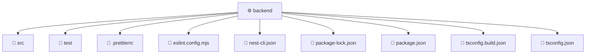

# ⚙️ Mavluda Beauty backend

[backend](/backend)

## 🎯 Purpose
Delivering luxury-tier architectural components and high-performance logic for the **backend** domain. This directory is a crucial part of the Mavluda Beauty full-stack ecosystem, ensuring seamless scalability, robust performance, and an elite digital experience.

## 🏗️ Architecture


## 📄 File Registry
| File Name | Type | Responsibility | Key Aliases Used |
|---|---|---|---|
| `.prettierrc` | File | Core logic and utilities for this domain. | N/A |
| `eslint.config.mjs` | File | Core logic and utilities for this domain. | N/A |
| `nest-cli.json` | Configuration | Project level settings and dependencies. | N/A |
| `package-lock.json` | Configuration | Project level settings and dependencies. | N/A |
| `package.json` | Configuration | Project level settings and dependencies. | N/A |
| `tsconfig.build.json` | Configuration | Project level settings and dependencies. | N/A |
| `tsconfig.json` | Configuration | Project level settings and dependencies. | N/A |


## 🔗 Dependencies
No external or alias dependencies detected.

## 🛠️ Usage
```typescript
// Example integration for backend
// Import capabilities from this directory to enrich your modules.
```
> This directory provides specialized logic tailored to the Mavluda Beauty standard.
