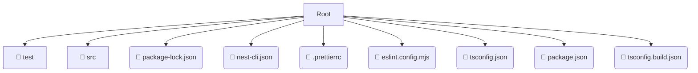

# ⚙️ backend

*Breadcrumbs:* [backend](/backend)

## 🎯 PURPOSE
This directory `backend` is an integral part of the Mavluda Beauty ecosystem. It supports the scalable NestJS backend architecture.
This directory is meticulously maintained to uphold the 'Luxury Professional' standards of the Mavluda Beauty brand.

## 🏗️ ARCHITECTURE


## 📄 FILE REGISTRY
| File Name | Type | Responsibility | Key Aliases Used |
|---|---|---|---|
| `package-lock.json` | `json` | Core functionality | `None` |
| `nest-cli.json` | `json` | Core functionality | `None` |
| `.prettierrc` | `prettierrc` | Core functionality | `None` |
| `eslint.config.mjs` | `mjs` | Core functionality | `@eslint/js` |
| `tsconfig.json` | `json` | Core functionality | `None` |
| `package.json` | `json` | Core functionality | `None` |
| `tsconfig.build.json` | `json` | Core functionality | `None` |

## 🔗 DEPENDENCIES
- `@eslint/js`

## 🛠️ USAGE
```typescript
// Example placeholder for interacting with the backend module
import { example } from './package-lock.json';
```
