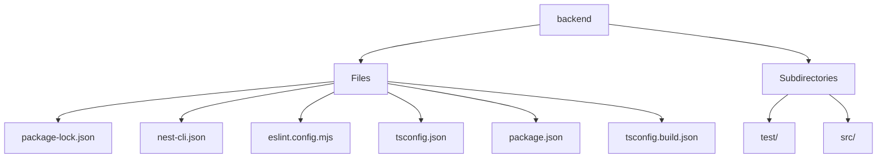

# 🏷️ Backend Directory

> *Elegance, Precision, and Luxury Professionalism — The Mavluda Beauty Standard.*

## 🧭 Breadcrumb Navigation
[backend](/backend)

## 🎯 Purpose
This directory encapsulates the essential architecture and logic for the **Backend** domain within the Mavluda Beauty ecosystem. It serves as a foundational component ensuring robust, scalable, and elegant operations.

## 🏗️ Architecture


## 📄 File Registry
| File Name | Type | Responsibility | Key Aliases Used |
|---|---|---|---|
| `package-lock.json` | Configuration | Defines logic and structure for package-lock.json. | None |
| `nest-cli.json` | Configuration | Defines logic and structure for nest-cli.json. | None |
| `eslint.config.mjs` | File | Defines logic and structure for eslint.config.mjs. | None |
| `tsconfig.json` | Configuration | Defines logic and structure for tsconfig.json. | @common, @modules |
| `package.json` | Configuration | Defines logic and structure for package.json. | None |
| `tsconfig.build.json` | Configuration | Defines logic and structure for tsconfig.build.json. | None |

## 🔗 Dependencies
- `@eslint/js`
- `eslint-plugin-prettier/recommended`
- `globals`
- `typescript-eslint`

## 🛠️ Usage
```typescript
// This directory primarily serves organizational or static purposes.
// Reference its contents dynamically based on your feature requirements.
```
