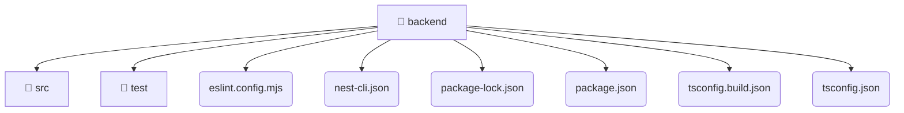

# [root](/) / [backend](/backend)

## 🏷️ 📁 Backend

### 🎯 PURPOSE
The `backend` directory provides core backend services and configuration.

### 🏗️ ARCHITECTURE


### 📄 FILE REGISTRY
| File Name | Type | Responsibility | Key Aliases Used |
|---|---|---|---|
| `eslint.config.mjs` | `mjs` | Configuration settings and environment setup. | @eslint |
| `nest-cli.json` | `json` | Core logic or foundational asset for this directory. | None |
| `package-lock.json` | `json` | Core logic or foundational asset for this directory. | None |
| `package.json` | `json` | Core logic or foundational asset for this directory. | None |
| `tsconfig.build.json` | `json` | Configuration settings and environment setup. | None |
| `tsconfig.json` | `json` | Configuration settings and environment setup. | None |

### 🔗 DEPENDENCIES
- `@eslint/js`
- `eslint-plugin-prettier/recommended`
- `globals`
- `typescript-eslint`

### 🛠️ USAGE
```typescript
// Seamlessly integrate backend into your refined workflows:
import { /* exported members */ } from '@path/to/backend';
```
