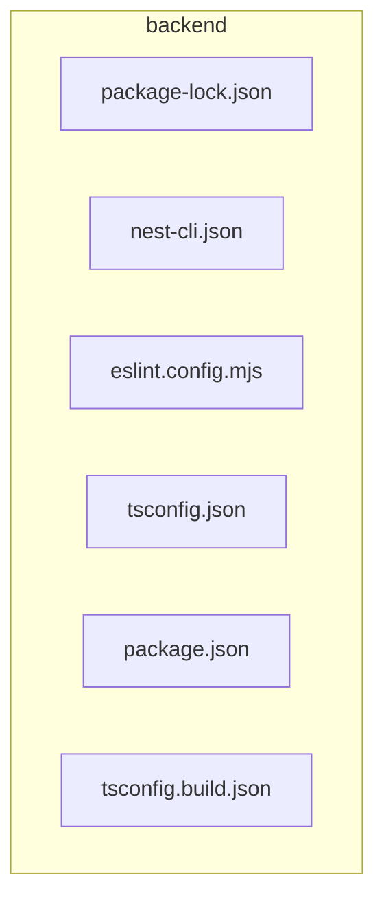

# ⚙️ backend

[backend](README.md)

---

### 🎯 PURPOSE
Elevating the digital experience for the Mavluda Beauty ecosystem, this module manages the sophisticated Root / Operational Layer operations.

*FSD Layer:* **Root / Operational Layer**

---

### 🏗️ ARCHITECTURE



---

### 📄 FILE REGISTRY
| File Name | Type | Responsibility | Key Aliases Used |
|-----------|------|----------------|------------------|
| `package-lock.json` | Source | Handles source logic for Mavluda Beauty's luxury standards. | `None` |
| `nest-cli.json` | Source | Handles source logic for Mavluda Beauty's luxury standards. | `None` |
| `eslint.config.mjs` | Source | Handles source logic for Mavluda Beauty's luxury standards. | `@eslint` |
| `tsconfig.json` | Source | Handles source logic for Mavluda Beauty's luxury standards. | `None` |
| `package.json` | Source | Handles source logic for Mavluda Beauty's luxury standards. | `None` |
| `tsconfig.build.json` | Source | Handles source logic for Mavluda Beauty's luxury standards. | `None` |

---

### 🔗 DEPENDENCIES
**Key Path Aliases Detected:** `@eslint`

Notable imports:
- `globals`
- `eslint-plugin-prettier/recommended`
- `@eslint/js`
- `typescript-eslint`

---

### 🛠️ USAGE
To interact with this directory's luxurious logic, integrate its exported components or services directly into your feature modules. Ensure strict adherence to the Root / Operational Layer boundaries.

```typescript
// Example integration snippet
import { FeatureModule } from '@path/to/backend';
```
