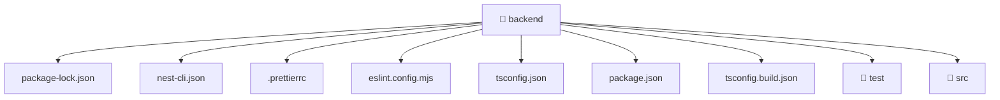

[🏠 Home](../README.md) > [backend](./README.md)

# ⚙️ backend

### 🎯 PURPOSE
Welcome to the exquisite **backend** module of the Mavluda Beauty ecosystem. This directory handles specific domain assets and logic. It is designed adhering to our 'Luxury Professional' standards.

### 🏗️ ARCHITECTURE


### 📄 FILE REGISTRY
| File Name | Type | Responsibility | Key Aliases Used |
|---|---|---|---|
| `.prettierrc` | Asset / File | Provides logic and definitions for .prettierrc. | None |
| `eslint.config.mjs` | Asset / File | Provides logic and definitions for eslint.config.mjs. | @eslint |
| `nest-cli.json` | JSON Configuration | Provides logic and definitions for nest-cli.json. | None |
| `package-lock.json` | JSON Configuration | Provides logic and definitions for package-lock.json. | None |
| `package.json` | JSON Configuration | Provides logic and definitions for package.json. | None |
| `tsconfig.build.json` | JSON Configuration | Provides logic and definitions for tsconfig.build.json. | None |
| `tsconfig.json` | JSON Configuration | Provides logic and definitions for tsconfig.json. | None |

### 🔗 DEPENDENCIES
- `@eslint/js`
- `eslint-plugin-prettier/recommended`
- `globals`
- `typescript-eslint`

### 🛠️ USAGE
```typescript
// Example interaction or integration snippet
// Import members from backend based on module boundaries
```
