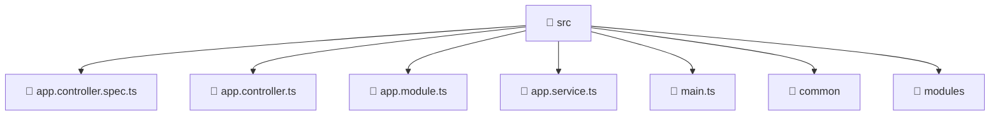

### 🧭 Breadcrumbs
[Root](/) > [backend](/backend) > [src](/backend/src)

# 📁 Src Directory
**Architecture Layer:** Domain/Infrastructure Layer

## 🎯 Purpose
Provides luxury professional architectural implementation for the src module within the Mavluda Beauty ecosystem. Ensure robust functionality and elegant integration with the broader architecture.

## 🏗️ ARCHITECTURE


## 📄 FILE REGISTRY
| File Name | Type | Responsibility | Key Aliases Used |
|---|---|---|---|
| `app.controller.spec.ts` | TypeScript | Unit testing and quality assurance for app.controller.spec.ts. | @nestjs/testing |
| `app.controller.ts` | TypeScript | Handles incoming HTTP requests and routing for app.controller.ts. | @nestjs/common |
| `app.module.ts` | TypeScript | Defines the architectural module boundaries for app.module.ts. | @nestjs/common, @modules/gallery, @modules/user, @nestjs/core, @modules/veil, @modules/partnership, @modules/auth, @modules/payment, @nestjs/serve-static, @modules/admin-settings, @modules/treatments, @modules/booking, @modules/inventory |
| `app.service.ts` | TypeScript | Encapsulates business logic and data access for app.service.ts. | @nestjs/common |
| `main.ts` | TypeScript | Provides core logic and orchestration for main.ts. | @nestjs/common, @nestjs/config, @nestjs/core |

## 🔗 DEPENDENCIES
- `@modules/admin-settings`
- `@modules/auth`
- `@modules/booking`
- `@modules/gallery`
- `@modules/inventory`
- `@modules/partnership`
- `@modules/payment`
- `@modules/treatments`
- `@modules/user`
- `@modules/veil`
- `@nestjs/common`
- `@nestjs/config`
- `@nestjs/core`
- `@nestjs/serve-static`
- `@nestjs/testing`

## 🛠️ USAGE
```typescript
// Example architectural integration for src
// Utilize the exported members according to Mavluda Beauty's standard conventions.
```

---
*Maintained by Mavluda Beauty - Architecture & Engineering*

---
*Maintained by Mavluda Beauty - Architecture & Engineering*