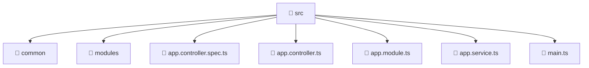

# 📁 src

[Root](/.) > [backend](/backend) > [src](/backend/src)

## 🎯 Purpose
Delivering luxury-tier architectural components and high-performance logic for the **Src** domain. This directory is a crucial part of the Mavluda Beauty full-stack ecosystem, ensuring seamless scalability, robust performance, and an elite digital experience.

**Architecture Layer:** Backend Infrastructure (Feature Sliced Design / Layered Architecture)

## 🏗️ Architecture


## 📄 File Registry
| File Name | Type | Responsibility | Key Aliases Used |
|---|---|---|---|
| `app.controller.spec.ts` | TypeScript | Core logic and utilities for this domain. | @nestjs |
| `app.controller.ts` | TypeScript | Core logic and utilities for this domain. | @nestjs |
| `app.module.ts` | TypeScript | Core logic and utilities for this domain. | @modules, @nestjs |
| `app.service.ts` | TypeScript | Core logic and utilities for this domain. | @nestjs |
| `main.ts` | TypeScript | Core logic and utilities for this domain. | @nestjs |

## 🔗 Dependencies
- `./app.controller`
- `./app.module`
- `./app.service`
- `./common/config/app-config.module`
- `./common/database/database.module`
- `./common/filters/i18n-exception.filter`
- `@modules/admin-settings`
- `@modules/auth`
- `@modules/booking`
- `@modules/gallery`
- `@modules/inventory`
- `@modules/partnership`
- `@modules/payment`
- `@modules/treatments`
- `@modules/user`
- `@modules/veil`
- `@nestjs/common`
- `@nestjs/config`
- `@nestjs/core`
- `@nestjs/serve-static`
- `@nestjs/testing`
- `path`

## 🛠️ Usage
```markdown
```markdown
> This directory acts primarily as a structural container or logic module.
> To interact with its contents, import the relevant exported members from the `index.ts` or specifically targeted files.
```
```
