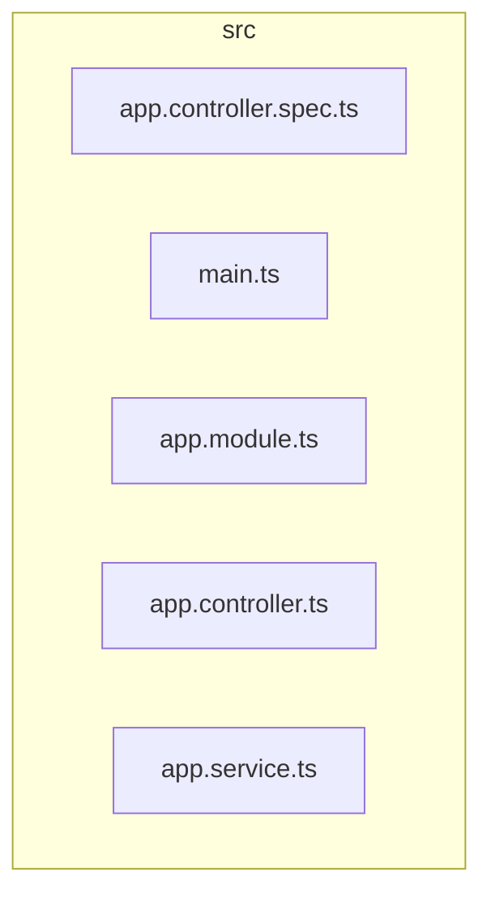

# 📂 src

[backend](../README.md) > [src](README.md)

---

### 🎯 PURPOSE
Elevating the digital experience for the Mavluda Beauty ecosystem, this module manages the sophisticated Root / Operational Layer operations.

*FSD Layer:* **Root / Operational Layer**

---

### 🏗️ ARCHITECTURE



---

### 📄 FILE REGISTRY
| File Name | Type | Responsibility | Key Aliases Used |
|-----------|------|----------------|------------------|
| `app.controller.spec.ts` | Unit Test | Handles unit test logic for Mavluda Beauty's luxury standards. | `@nestjs` |
| `main.ts` | Source | Handles source logic for Mavluda Beauty's luxury standards. | `@nestjs` |
| `app.module.ts` | Module | Handles module logic for Mavluda Beauty's luxury standards. | `@modules, @nestjs` |
| `app.controller.ts` | Controller | Handles controller logic for Mavluda Beauty's luxury standards. | `@nestjs` |
| `app.service.ts` | Service | Handles service logic for Mavluda Beauty's luxury standards. | `@nestjs` |

---

### 🔗 DEPENDENCIES
**Key Path Aliases Detected:** `@modules`, `@nestjs`

Notable imports:
- `@modules/treatments`
- `./common/config/app-config.module`
- `@modules/user`
- `@modules/inventory`
- `path`
- `./app.controller`
- `@modules/partnership`
- `@nestjs/config`
- `@nestjs/common`
- `@modules/gallery`
- *...and 12 more*

---

### 🛠️ USAGE
To interact with this directory's luxurious logic, integrate its exported components or services directly into your feature modules. Ensure strict adherence to the Root / Operational Layer boundaries.

```typescript
// Example integration snippet
import { FeatureModule } from '@path/to/src';
```
