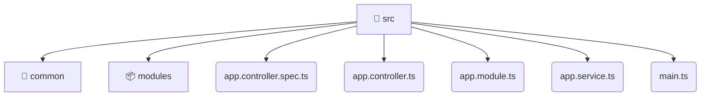

# [backend](/backend) / [src](/backend/src)

## 🏷️ 📁 Src

### 🎯 PURPOSE
The `src` directory forms a critical foundation within the Mavluda Beauty ecosystem, meticulously orchestrating the src logic to ensure a seamless and premium experience. Rooted in the NestJS backend architecture, it delivers robust, high-performance operations tailored for high-end beauty and wedding services.

### 🏗️ ARCHITECTURE


### 📄 FILE REGISTRY
| File Name | Type | Responsibility | Key Aliases Used |
|---|---|---|---|
| `app.controller.spec.ts` | `ts` | Encapsulates premium logic and definitions for `app.controller.spec.ts`. | @nestjs/testing |
| `app.controller.ts` | `ts` | Encapsulates premium logic and definitions for `app.controller.ts`. | @nestjs/common |
| `app.module.ts` | `ts` | Encapsulates premium logic and definitions for `app.module.ts`. | @modules/veil, @modules/booking, @modules/admin-settings, @nestjs/common, @modules/inventory, @modules/auth, @modules/treatments, @modules/user, @modules/gallery, @modules/partnership, @nestjs/serve-static, @modules/payment |
| `app.service.ts` | `ts` | Encapsulates premium logic and definitions for `app.service.ts`. | @nestjs/common |
| `main.ts` | `ts` | Encapsulates premium logic and definitions for `main.ts`. | @nestjs/config, @nestjs/common, @nestjs/core |


### 🔗 DEPENDENCIES
- `@modules/admin-settings`
- `@modules/auth`
- `@modules/booking`
- `@modules/gallery`
- `@modules/inventory`
- `@modules/partnership`
- `@modules/payment`
- `@modules/treatments`
- `@modules/user`
- `@modules/veil`
- `@nestjs/common`
- `@nestjs/config`
- `@nestjs/core`
- `@nestjs/serve-static`
- `@nestjs/testing`

### 🛠️ USAGE
```typescript
// Seamlessly integrate src into your refined workflows:
import { /* exported members */ } from '@path/to/src';
```
