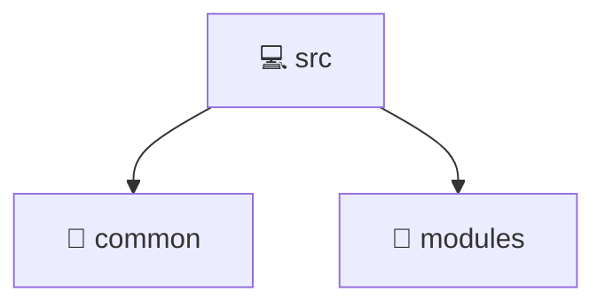

# 💻 src

[Root](/.) > [backend](/backend) > [src](/backend/src)

## 🎯 Purpose
Delivering luxury-tier architectural components and high-performance logic for the **src** domain. This directory is a crucial part of the Mavluda Beauty full-stack ecosystem, ensuring seamless scalability, robust performance, and an elite digital experience.

## 🏗️ Architecture


## 📄 File Registry
| File Name | Type | Responsibility | Key Aliases Used |
|---|---|---|---|
| `app.controller.spec.ts` | Test | Ensures code quality and regression prevention. | @nestjs |
| `app.controller.ts` | Controller | Request handling and routing. | @nestjs |
| `app.module.ts` | Module | Core logic and utilities for this domain. | @nestjs, @modules |
| `app.service.ts` | Service | Business logic and state management. | @nestjs |
| `main.ts` | File | Core logic and utilities for this domain. | @nestjs |


## 🔗 Dependencies
- `@nestjs/testing`
- `./app.controller`
- `./app.service`
- `@nestjs/common`
- `@nestjs/serve-static`
- `path`
- `./common/config/app-config.module`
- `./common/database/database.module`
- `@modules/user`
- `@modules/admin-settings`
- `@modules/veil`
- `@modules/treatments`
- `@modules/gallery`
- `@modules/auth`
- `@modules/payment`
- `@modules/booking`
- `@modules/inventory`
- `@modules/partnership`
- `@nestjs/core`
- `@nestjs/config`
- `./app.module`

## 🛠️ Usage
```typescript
// Example usage within the Mavluda Beauty ecosystem
import { relevantMember } from './app.controller.spec';

// Integrate into the application architecture
relevantMember.execute();
```
