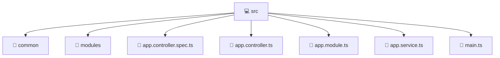

# 💻 Mavluda Beauty src

[backend](/backend) / [src](/backend/src)

## 🎯 Purpose
Delivering luxury-tier architectural components and high-performance logic for the **src** domain. This directory is a crucial part of the Mavluda Beauty full-stack ecosystem, ensuring seamless scalability, robust performance, and an elite digital experience.

## 🏗️ Architecture


## 📄 File Registry
| File Name | Type | Responsibility | Key Aliases Used |
|---|---|---|---|
| `app.controller.spec.ts` | Test | Verifies correctness and prevents regressions. | `@nestjs/testing` |
| `app.controller.ts` | Controller | Handles HTTP requests and orchestrates responses. | `@nestjs/common` |
| `app.module.ts` | Module | Groups related capabilities and defines dependencies. | `@nestjs/common, @nestjs/serve-static, @modules/user, @modules/admin-settings, @modules/veil, @modules/treatments, @modules/gallery, @modules/auth, @modules/payment, @modules/booking, @modules/inventory, @modules/partnership` |
| `app.service.ts` | Service | Encapsulates business logic and API calls. | `@nestjs/common` |
| `main.ts` | TypeScript Logic | Core logic and utilities for this domain. | `@nestjs/common, @nestjs/core, @nestjs/config` |


## 🔗 Dependencies
**Path Aliases:**
- `@nestjs/testing`
- `@nestjs/common`
- `@nestjs/serve-static`
- `@modules/user`
- `@modules/admin-settings`
- `@modules/veil`
- `@modules/treatments`
- `@modules/gallery`
- `@modules/auth`
- `@modules/payment`
- `@modules/booking`
- `@modules/inventory`
- `@modules/partnership`
- `@nestjs/core`
- `@nestjs/config`

**External Packages:**
- `path`


## 🛠️ Usage
```typescript
// Example integration for src
// Import capabilities from this directory to enrich your modules.
```
> This directory provides specialized logic tailored to the Mavluda Beauty standard.
