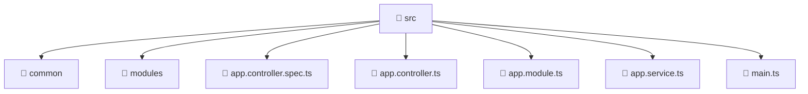

<!--
Mavluda Beauty - Luxury Professional Documentation
Generated for 100% Architectural Transparency
-->
[Home](../../README.md) > [backend](../README.md) > [src](./README.md)

# 📁 SRC Directory

## 🎯 PURPOSE
Manages the src module, providing robust and secure backend services for the Mavluda Beauty application.

## 🏗️ ARCHITECTURE


## 📄 FILE REGISTRY
| File Name | Type | Responsibility | Key Aliases Used |
|---|---|---|---|
| `app.controller.spec.ts` | TypeScript | Unit testing and verification. | @nestjs |
| `app.controller.ts` | TypeScript | Request routing and response handling. | @nestjs |
| `app.module.ts` | TypeScript | Module configuration and dependency injection. | @nestjs, @modules |
| `app.service.ts` | TypeScript | Business logic and service orchestration. | @nestjs |
| `main.ts` | TypeScript | Core logic implementation. | @nestjs |


## 🔗 DEPENDENCIES
- `@nestjs/testing`
- `./app.controller`
- `./app.service`
- `@nestjs/common`
- `@nestjs/serve-static`
- `path`
- `./common/config/app-config.module`
- `./common/database/database.module`
- `@modules/user`
- `@modules/admin-settings`
- `@modules/veil`
- `@modules/treatments`
- `@modules/gallery`
- `@modules/auth`
- `@modules/payment`
- `@modules/booking`
- `@modules/inventory`
- `@modules/partnership`
- `@nestjs/core`
- `@nestjs/config`
- `./app.module`

## 🛠️ USAGE
```typescript
// Example placeholder for interacting with src
// Consult the individual files in the registry for specific APIs.
```
