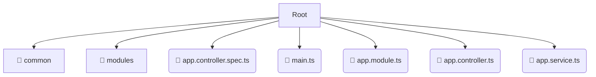

# 💻 src

*Breadcrumbs:* [backend](/backend) / [src](/backend/src)

## 🎯 PURPOSE
This directory `src` is an integral part of the Mavluda Beauty ecosystem. It supports the scalable NestJS backend architecture.
This directory is meticulously maintained to uphold the 'Luxury Professional' standards of the Mavluda Beauty brand.

## 🏗️ ARCHITECTURE


## 📄 FILE REGISTRY
| File Name | Type | Responsibility | Key Aliases Used |
|---|---|---|---|
| `app.controller.spec.ts` | `ts` | Unit testing | `@nestjs/testing` |
| `main.ts` | `ts` | Core functionality | `@nestjs/common, @nestjs/core, @nestjs/config` |
| `app.module.ts` | `ts` | Module configuration | `@nestjs/common, @modules/veil, @modules/admin-settings...` |
| `app.controller.ts` | `ts` | Core functionality | `@nestjs/common` |
| `app.service.ts` | `ts` | Core functionality | `@nestjs/common` |

## 🔗 DEPENDENCIES
- `@nestjs/common`
- `@modules/veil`
- `@modules/admin-settings`
- `@modules/auth`
- `@nestjs/serve-static`
- `@modules/payment`
- `@modules/inventory`
- `@modules/booking`
- `@modules/partnership`
- `@nestjs/core`
- `@nestjs/config`
- `@nestjs/testing`
- `@modules/user`
- `@modules/treatments`
- `@modules/gallery`

## 🛠️ USAGE
```typescript
// Example placeholder for interacting with the src module
import { example } from './app.controller.spec.ts';
```
