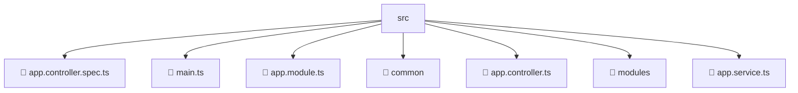

# 📂 SRC

> 💎 **Mavluda Beauty - Luxury Professional Architecture**

### 📍 Breadcrumb Navigation
`. > backend > src`

## 🎯 PURPOSE
This directory encapsulates `Backend Core/Infrastructure` level functionality within the Mavluda Beauty ecosystem, ensuring proper separation of concerns and architectural transparency.

**FSD / Architecture Layer:** `Backend Core/Infrastructure`

## 🏗️ ARCHITECTURE


## 📄 FILE REGISTRY

| Item Name | Type | Responsibility | Key Aliases Used |
|-----------|------|----------------|------------------|
| `📄 app.controller.spec.ts` | `.ts` | Controller logic | `@nestjs/testing` |
| `📄 main.ts` | `.ts` | General functionality | `@nestjs/config, @nestjs/common, @nestjs/core` |
| `📄 app.module.ts` | `.ts` | Module configuration | `@modules/auth, @modules/user, @nestjs/serve-static, @nestjs/common, @modules/partnership, @modules/gallery, @modules/inventory, @modules/payment, @modules/treatments, @modules/booking, @modules/veil, @modules/admin-settings` |
| `📁 common` | `Directory` | Subdirectory logic grouping | `None` |
| `📄 app.controller.ts` | `.ts` | Controller logic | `@nestjs/common` |
| `📁 modules` | `Directory` | Subdirectory logic grouping | `None` |
| `📄 app.service.ts` | `.ts` | Service logic | `@nestjs/common` |

## 🔗 DEPENDENCIES
- `@modules/auth`
- `@modules/user`
- `@nestjs/core`
- `@nestjs/serve-static`
- `@nestjs/common`
- `@nestjs/config`
- `@modules/gallery`
- `@modules/inventory`
- `@modules/payment`
- `@modules/treatments`
- `@nestjs/testing`
- `@modules/admin-settings`
- `@modules/booking`
- `@modules/veil`
- `@modules/partnership`

## 🛠️ USAGE
```typescript
// Example usage context
import { ... } from './app.controller.spec';

// Integrate app.controller.spec logic into your feature.
```
