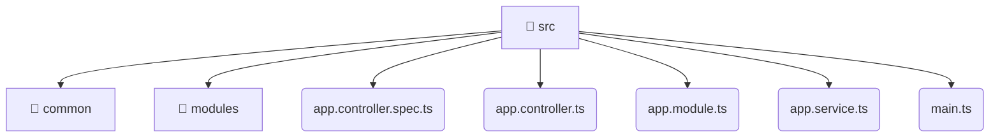

# [root](/) / [backend](/backend) / [src](/backend/src)

## 🏷️ 📁 Src

### 🎯 PURPOSE
The `src` directory forms a critical foundation within the Mavluda Beauty ecosystem, meticulously orchestrating the src logic to ensure a seamless and premium experience.

### 🏗️ ARCHITECTURE


### 📄 FILE REGISTRY
| File Name | Type | Responsibility | Key Aliases Used |
|---|---|---|---|
| `app.controller.spec.ts` | `ts` | Handles incoming HTTP requests. | @nestjs |
| `app.controller.ts` | `ts` | Handles incoming HTTP requests. | @nestjs |
| `app.module.ts` | `ts` | Module configuration and provider registration. | @modules, @nestjs |
| `app.service.ts` | `ts` | Business logic and service layer. | @nestjs |
| `main.ts` | `ts` | Core logic implementation. | @nestjs |

### 🔗 DEPENDENCIES
- `./app.controller`
- `./app.module`
- `./app.service`
- `./common/config/app-config.module`
- `./common/database/database.module`
- `@modules/admin-settings`
- `@modules/auth`
- `@modules/booking`
- `@modules/gallery`
- `@modules/inventory`
- *...and more.*

### 🛠️ USAGE
```typescript
// Seamlessly integrate src into your refined workflows:
import { /* exported members */ } from '@path/to/src';
```
