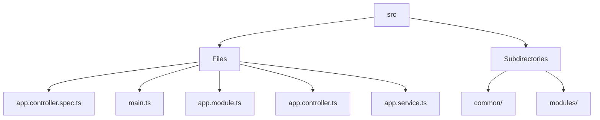

# 🏷️ Src Directory

> *Elegance, Precision, and Luxury Professionalism — The Mavluda Beauty Standard.*

## 🧭 Breadcrumb Navigation
[backend](/backend) ➔ [src](/backend/src)

## 🎯 Purpose
This directory encapsulates the essential architecture and logic for the **Src** domain within the Mavluda Beauty ecosystem. It serves as a foundational component ensuring robust, scalable, and elegant operations.

## 🏗️ Architecture


## 📄 File Registry
| File Name | Type | Responsibility | Key Aliases Used |
|---|---|---|---|
| `app.controller.spec.ts` | TypeScript | Defines logic and structure for app.controller.spec.ts. | None |
| `main.ts` | TypeScript | Defines logic and structure for main.ts. | None |
| `app.module.ts` | TypeScript | Exports: AppModule | @modules |
| `app.controller.ts` | TypeScript | Exports: AppController | None |
| `app.service.ts` | TypeScript | Exports: AppService | None |

## 🔗 Dependencies
- `@modules/admin-settings`
- `@modules/auth`
- `@modules/booking`
- `@modules/gallery`
- `@modules/inventory`
- `@modules/partnership`
- `@modules/payment`
- `@modules/treatments`
- `@modules/user`
- `@modules/veil`
- `@nestjs/common`
- `@nestjs/config`
- `@nestjs/core`
- `@nestjs/serve-static`
- `@nestjs/testing`

## 🛠️ Usage
```typescript
// To utilize the luxurious capabilities of this module:
import { AppModule } from './path/to/appmodule';

// Ensure properly typed interactions per Mavluda Beauty standards
```
