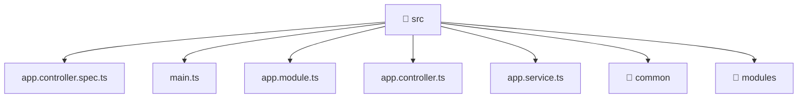

[🏠 Home](../../README.md) > [backend](../README.md) > [src](./README.md)

# 💻 src

### 🎯 PURPOSE
Welcome to the exquisite **src** module of the Mavluda Beauty ecosystem. This directory focuses on orchestrating Business Services, HTTP APIs. It is designed adhering to our 'Luxury Professional' standards.

### 🏗️ ARCHITECTURE


### 📄 FILE REGISTRY
| File Name | Type | Responsibility | Key Aliases Used |
|---|---|---|---|
| `app.controller.spec.ts` | Unit Test | Provides logic and definitions for app.controller.spec.ts. | @nestjs |
| `app.controller.ts` | NestJS Controller | Handles incoming HTTP requests Defines classes: AppController. | @nestjs |
| `app.module.ts` | Angular Module | Configures an application module or layer Defines classes: AppModule. | @nestjs, @modules |
| `app.service.ts` | Angular Service | Provides injectable business logic or services Defines classes: AppService. | @nestjs |
| `main.ts` | TypeScript File | Implements utilities: bootstrap. | @nestjs |

### 🔗 DEPENDENCIES
- `@modules/admin-settings`
- `@modules/auth`
- `@modules/booking`
- `@modules/gallery`
- `@modules/inventory`
- `@modules/partnership`
- `@modules/payment`
- `@modules/treatments`
- `@modules/user`
- `@modules/veil`
- `@nestjs/common`
- `@nestjs/config`
- `@nestjs/core`
- `@nestjs/serve-static`
- `@nestjs/testing`
- `path`

### 🛠️ USAGE
```typescript
// Example interaction or integration snippet
// Import members from src based on module boundaries
```
