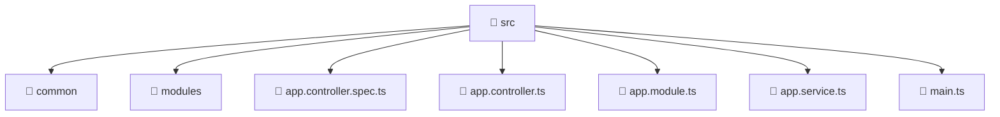

[Root](/.) > [backend](/backend) > [src](/backend/src)

# 📁 Src

## 🎯 Purpose
Delivering luxury-tier architectural components and high-performance logic for the **src** domain. This directory is a crucial part of the Mavluda Beauty full-stack ecosystem, ensuring seamless scalability, robust performance, and an elite digital experience.

## 🏗️ Architecture


## 📄 File Registry
| File Name | Type | Responsibility | Key Aliases Used |
|---|---|---|---|
| `app.controller.spec.ts` | TypeScript | Unit testing and quality assurance for app.controller.spec.ts. | @nestjs |
| `app.controller.ts` | TypeScript | Handles incoming HTTP requests and routing for app.controller.ts. | @nestjs |
| `app.module.ts` | TypeScript | Defines the architectural module boundaries for app.module.ts. | @modules, @nestjs |
| `app.service.ts` | TypeScript | Encapsulates business logic and data access for app.service.ts. | @nestjs |
| `main.ts` | TypeScript | Provides core logic and orchestration for main.ts. | @nestjs |

## 🔗 Dependencies
- `./app.controller`, `./app.module`, `./app.service`, `./common/config/app-config.module`, `./common/database/database.module`, `./common/filters/i18n-exception.filter`, `@modules/admin-settings`, `@modules/auth`, `@modules/booking`, `@modules/gallery`, `@modules/inventory`, `@modules/partnership`, `@modules/payment`, `@modules/treatments`, `@modules/user`, `@modules/veil`, `@nestjs/common`, `@nestjs/config`, `@nestjs/core`, `@nestjs/serve-static`, `@nestjs/testing`, `path`

## 🛠️ Usage
```typescript
// Example usage within the Mavluda Beauty ecosystem
import { relevantMember } from './core';

// Integrate into the application architecture
relevantMember.execute();
```