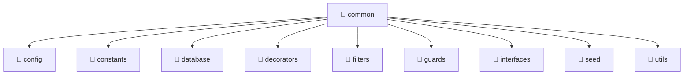

# 📁 Common Directory

[Root](/.) / [backend](/backend) / [src](/backend/src) / [common](/backend/src/common)

## 🎯 Purpose
Delivering luxury-tier architectural components and high-performance logic for the **common** domain. This directory is a crucial part of the Mavluda Beauty full-stack ecosystem, ensuring seamless scalability, robust performance, and an elite digital experience.

## 🏗️ Architecture


## 📄 File Registry
| File Name | Type | Responsibility | Key Aliases Used |
|---|---|---|---|
| `config` | Directory | Contains architectural sub-modules and layer logic for config. | N/A |
| `constants` | Directory | Contains architectural sub-modules and layer logic for constants. | N/A |
| `database` | Directory | Contains architectural sub-modules and layer logic for database. | N/A |
| `decorators` | Directory | Contains architectural sub-modules and layer logic for decorators. | N/A |
| `filters` | Directory | Contains architectural sub-modules and layer logic for filters. | N/A |
| `guards` | Directory | Contains architectural sub-modules and layer logic for guards. | N/A |
| `interfaces` | Directory | Contains architectural sub-modules and layer logic for interfaces. | N/A |
| `seed` | Directory | Contains architectural sub-modules and layer logic for seed. | N/A |
| `utils` | Directory | Contains architectural sub-modules and layer logic for utils. | N/A |

## 🔗 Dependencies
- Relies on internal Mavluda Beauty architecture and designated FSD layers.
- See 'Key Aliases Used' in the File Registry for explicit cross-domain references.

## 🛠️ Usage
```typescript
// Example usage within the Mavluda Beauty ecosystem
import { relevantMember } from './core';

// Integrate into the application architecture
relevantMember.execute();
```
