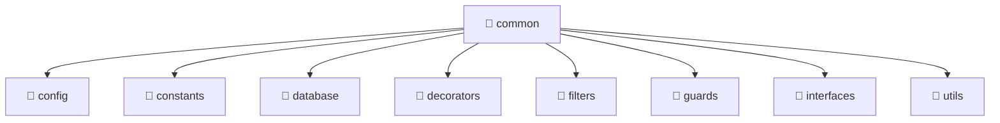

# 📁 common

[Root](/.) > [backend](/backend) > [src](/backend/src) > [common](/backend/src/common)

## 🎯 Purpose
Shared utility functions, helpers, and common logic applicable across multiple modules.

## 🏗️ Architecture


## 📄 File Registry
| File Name | Type | Responsibility | Key Aliases Used |
|---|---|---|---|

## 🔗 Dependencies
- No external dependencies.

## 🛠️ Usage
```typescript
import { specificUtility } from './utils';
const result = specificUtility(input);
```
