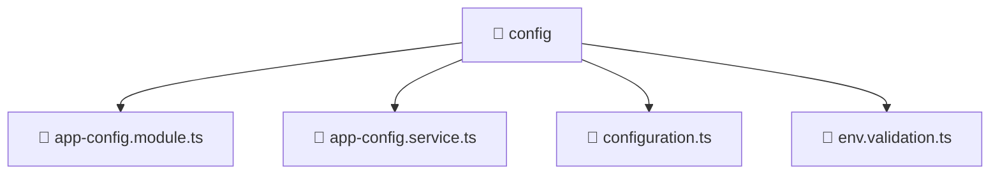

# 📁 Mavluda Beauty config

[backend](/backend) / [src](/backend/src) / [common](/backend/src/common) / [config](/backend/src/common/config)

## 🎯 Purpose
Delivering luxury-tier architectural components and high-performance logic for the **config** domain. This directory is a crucial part of the Mavluda Beauty full-stack ecosystem, ensuring seamless scalability, robust performance, and an elite digital experience.

## 🏗️ Architecture


## 📄 File Registry
| File Name | Type | Responsibility | Key Aliases Used |
|---|---|---|---|
| `app-config.module.ts` | Module | Groups related capabilities and defines dependencies. | `@nestjs/common, @nestjs/config` |
| `app-config.service.ts` | Service | Encapsulates business logic and API calls. | `@nestjs/common, @nestjs/config` |
| `configuration.ts` | TypeScript Logic | Core logic and utilities for this domain. | N/A |
| `env.validation.ts` | TypeScript Logic | Core logic and utilities for this domain. | N/A |


## 🔗 Dependencies
**Path Aliases:**
- `@nestjs/common`
- `@nestjs/config`

**External Packages:**
- `class-transformer`
- `class-validator`


## 🛠️ Usage
```typescript
// Example integration for config
// Import capabilities from this directory to enrich your modules.
```
> This directory provides specialized logic tailored to the Mavluda Beauty standard.
