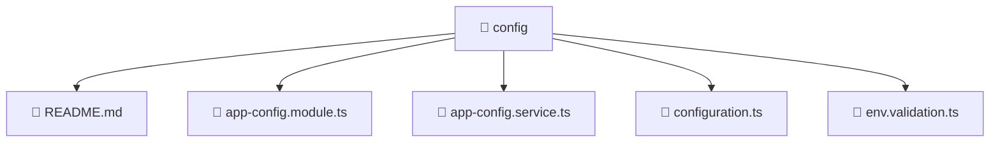

# 📁 config

[Root](/.) > [backend](/backend) > [src](/backend/src) > [common](/backend/src/common) > [config](/backend/src/common/config)

## 🎯 Purpose
Delivering luxury-tier architectural components and high-performance logic for the **config** domain. This directory is a crucial part of the Mavluda Beauty full-stack ecosystem, ensuring seamless scalability, robust performance, and an elite digital experience.

## 🏗️ Architecture


## 📄 File Registry
| File Name | Type | Responsibility | Key Aliases Used |
|---|---|---|---|
| `README.md` | Markdown | Provides core logic and configuration for README.md. | N/A |
| `app-config.module.ts` | TypeScript | Defines the architectural module boundaries for app-config.module.ts. | @nestjs |
| `app-config.service.ts` | TypeScript | Encapsulates business logic and data access for app-config.service.ts. | @nestjs |
| `configuration.ts` | TypeScript | Provides core logic and orchestration for configuration.ts. | N/A |
| `env.validation.ts` | TypeScript | Provides core logic and orchestration for env.validation.ts. | N/A |

## 🔗 Dependencies
- `./app-config.service`
- `./config`
- `./configuration`
- `./env.validation`
- `@nestjs/common`
- `@nestjs/config`
- `class-transformer`
- `class-validator`

## 🛠️ Usage
```typescript
// Example usage within the Mavluda Beauty ecosystem
import { relevantMember } from './config';

// Integrate into the application architecture
relevantMember.execute();
```
