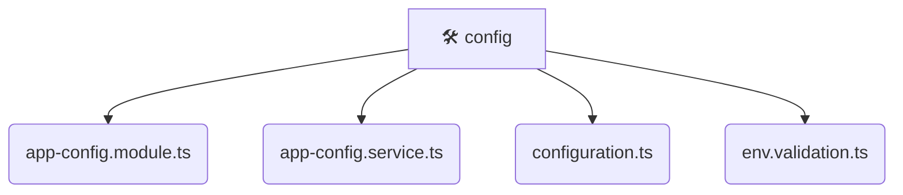

# [backend](/backend) / [src](/backend/src) / [common](/backend/src/common) / [config](/backend/src/common/config)

## 🏷️ 🛠️ Config

### 🎯 PURPOSE
The `config` directory forms a critical foundation within the Mavluda Beauty ecosystem, meticulously orchestrating the config logic to ensure a seamless and premium experience. Rooted in the NestJS backend architecture, it delivers robust, high-performance operations tailored for high-end beauty and wedding services.

### 🏗️ ARCHITECTURE


### 📄 FILE REGISTRY
| File Name | Type | Responsibility | Key Aliases Used |
|---|---|---|---|
| `app-config.module.ts` | `ts` | Encapsulates premium logic and definitions for `app-config.module.ts`. | @nestjs/config, @nestjs/common |
| `app-config.service.ts` | `ts` | Encapsulates premium logic and definitions for `app-config.service.ts`. | @nestjs/config, @nestjs/common |
| `configuration.ts` | `ts` | Encapsulates premium logic and definitions for `configuration.ts`. | None |
| `env.validation.ts` | `ts` | Encapsulates premium logic and definitions for `env.validation.ts`. | None |


### 🔗 DEPENDENCIES
- `@nestjs/common`
- `@nestjs/config`

### 🛠️ USAGE
```typescript
// Seamlessly integrate config into your refined workflows:
import { /* exported members */ } from '@path/to/config';
```
